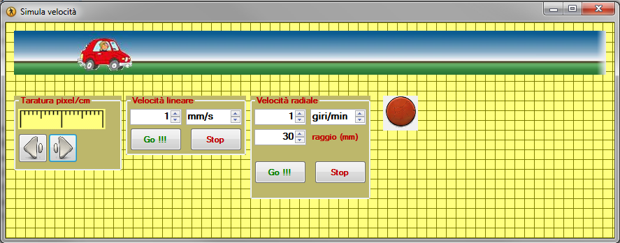

#SimulaVel

## A software for simulate linear or circular speed

Usually in my work I need to specify the speed of some movements, or I have to decide the speed of something. But when I say 250 mm/s is not simple to understand the real entity of this speed. So I made this simple software to simulate the speeds.

- **Taratura pixel/cm:** is to set the pixel/cm dimension
- **Velocità lineare:** is to simulate linear speed
- **Velocità radiale:** is to simulate circular speed
